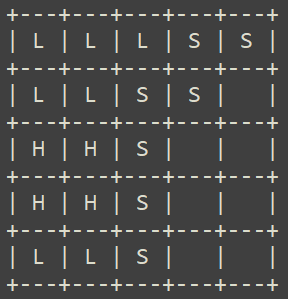

# TextCppGame
This is a 100% text game based on console and scenarios generated by chat gpt
# Main Order
Build RPG game in c++ with functionality of:
+ checking stats of player
+ moving player
+ interaction with npc
+ interaction with world
+ saving game

## Game flow
1. Show description of location
2. Wait for player Command
3. execute command and go for step 2

## Commands
### / [ North, East, South, West ]
move a character to next specific location
### / talk [ npc_name ]
talk to specific npc in location
### / look [ around, npc_name, item, object ]
get specific description of object / location
### / pickup [ item ]
pickup specific item
### / equipment
show equipment of player
### / stats
show statistics of player

## Map
Map is square based system looks like it:
  
where:
+ "L" - Land
+ "H" - Hall
+ "S" - Sea
+ "&nbsp;&nbsp;" - unexplored
## Player statistics
+ health
+ level
# FEATURES
- combat
- crafting
- chatgpt map generator
- types of location
- survival mode (working time of game)